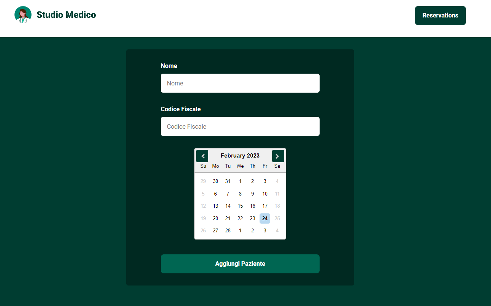
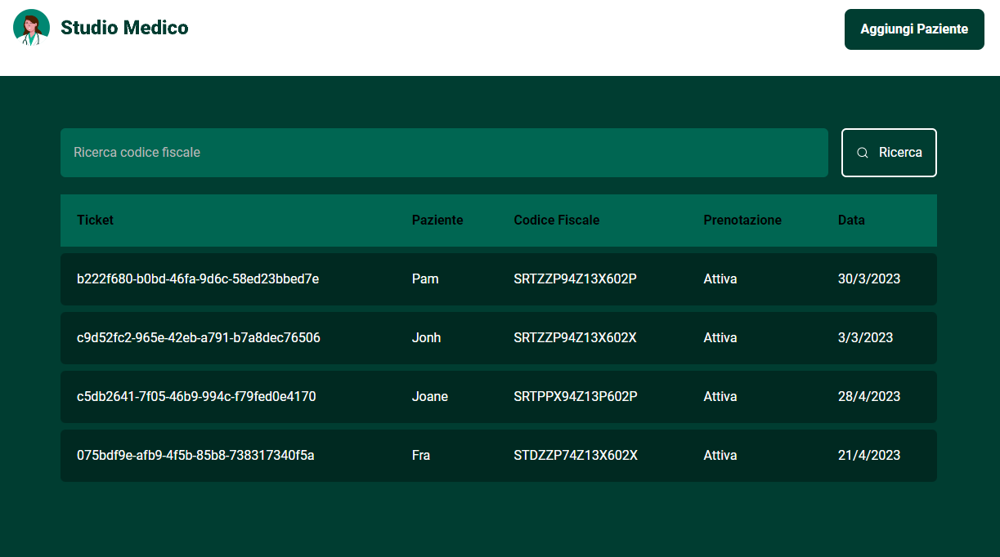

### Studio Medico

## Tech

- React
- Typescript
- Styled-components
- Json-server

## Getting Started

Clone the project and access the folder.

```
git clone https://github.com/filipesaretta/studio-medico

cd studio-medico

```

Install the dependencies and start.

```
npm install

npm run dev

```

Start the server

```
npm run server
```




